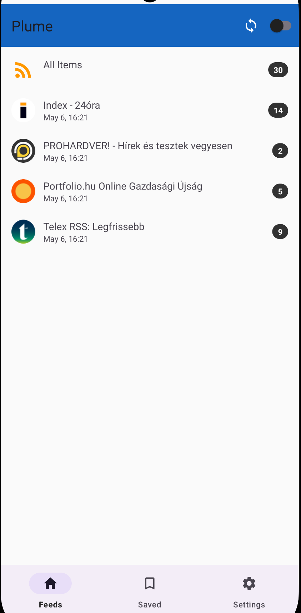

#  Plume RSS Reader

: 

Plume is a modern, lightweight RSS reader for Android, designed to provide a focused and distraction-free reading experience. Whether you are catching up on tech news, blogs, or daily headlines, Plume brings all your favorite content into one clean interface.

## 📸 Screenshots

  

## Key Features

- **Service Integration**: Supports **Feedly** and **TheOldReader** for seamless synchronization across devices.
- **Read Anywhere**: Fully functional **Offline Mode**. Articles and images are cached so you can read even without an internet connection.
- **Listen on the Go**: Built-in **Text-to-Speech (TTS)** support allows you to listen to articles while commuting or multitasking.
- **Quick Access Widget**: A handy home screen widget to see your latest unread articles at a glance.
- **Clean & Focused**: Automatically strips clutter from articles using advanced HTML parsing for a pure reading experience.
- **Dark Mode**: Beautifully crafted dark theme for comfortable reading at night.
- **Customizable**: Adjust font sizes and themes to suit your preferences.

## 📱 How to Use

1. **Download the App**: Get the latest `.apk` file from the [Releases](../../releases) section (or from the provided link).
2. **Install**: Open the downloaded file on your Android device. You may need to enable "Install from Unknown Sources" in your settings.
3. **Log In**: Choose your preferred RSS service (Feedly or TheOldReader) and log in.
4. **Enjoy**: Your feeds will begin syncing immediately!

## 🔒 Privacy

Plume is built with privacy in mind. It does not contain ads or third-party tracking. Your data belongs to you and your RSS provider.

---
*Note: This repository contains the documentation and distribution files for the Plume app.*
